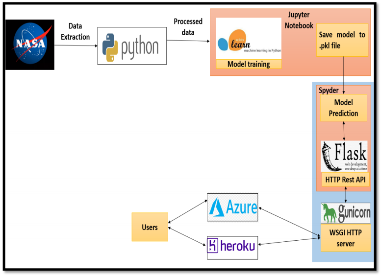
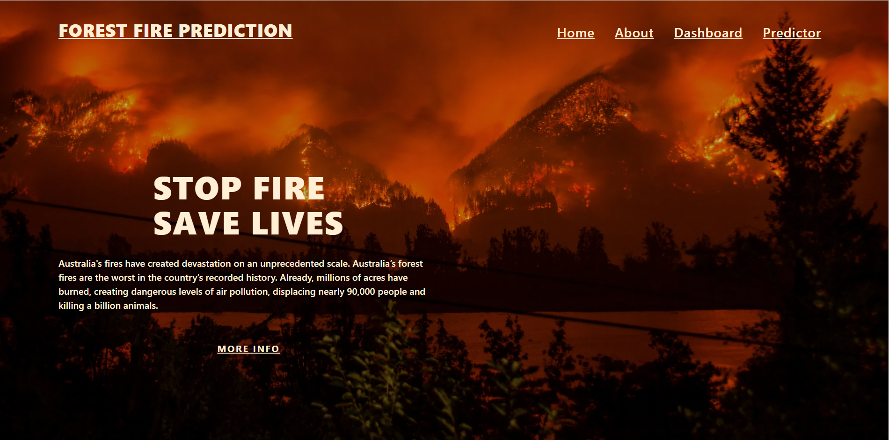
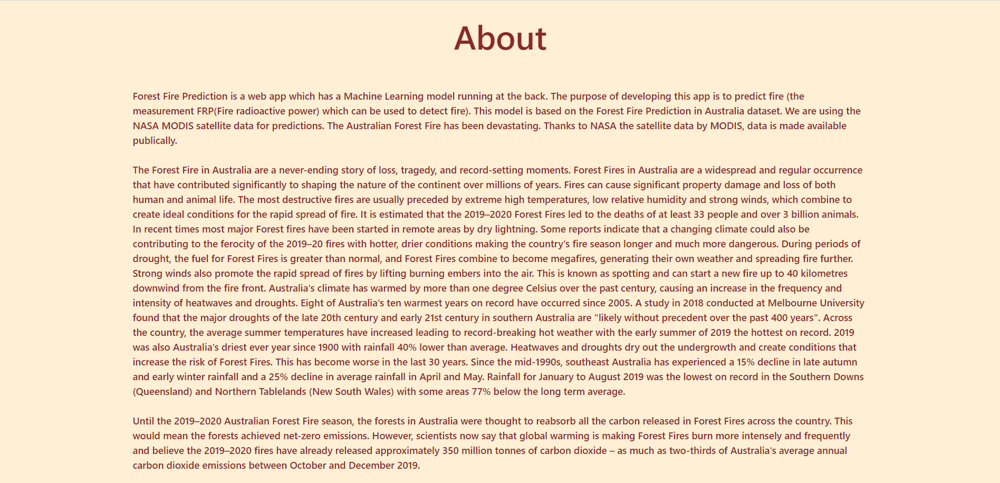
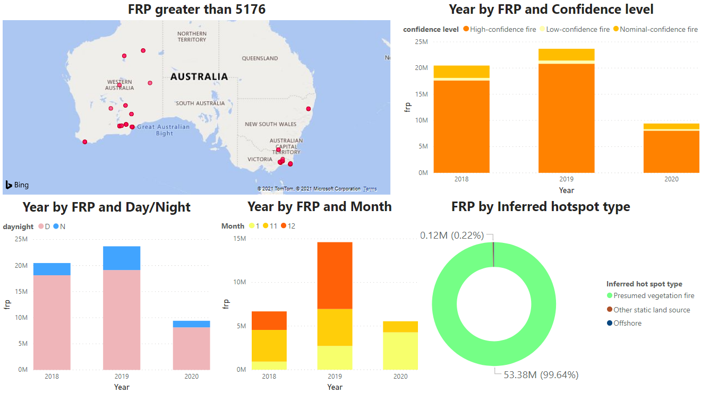
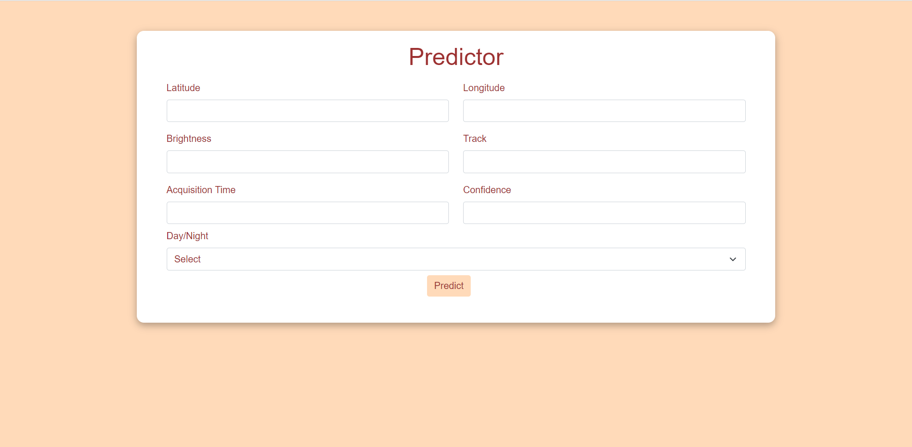

# Forest_Fire_Prediction App
Forest Fire Prediction is a web app which has a Machine Learning model running at the back. The purpose of developing this app is to predict fire (the measurement FRP(Fire radioactive power) which can be used to detect fire). This model is based on the Forest Fire Prediction in Australia dataset. We are using the NASA MODIS satellite data for predictions. The Australian Forest Fire has been devastating. Thanks to NASA the satellite data by MODIS, data is made available publically. 
 
# Heroku Website Link:  
["https://forestfirepredictionapp.herokuapp.com/"](https://forestfirepredictionapp.herokuapp.com/)
# Azure Website Link:  
["https://forestfireprediction.azurewebsites.net/"](https://forestfireprediction.azurewebsites.net/)

# Tech Stack
* Front-End: HTML, CSS, Bootstrap
* Back-End: Flask
* IDE: Jupyter notebook

# Introduction
# Forest Fire Prediction
 Australia's fires have created devastation on an unprecedented scale. Australia’s forest fires are the worst 
in the country’s recorded history. Already, millions of acres have burned, creating dangerous levels of air 
pollution, displacing nearly 90,000 people and killing a billion animals. 
 Forest Fire Prediction is a web app which has a Machine Learning model running at the back. The purpose 
of developing this app is to predict fire (the measurement FRP (Fire radioactive power) which can be used 
to detect fire). This model is based on the Forest Fire Prediction in Australia dataset. We are using the NASA 
MODIS satellite data for predictions. The Australian Forest Fire has been devastating. Thanks to NASA the 
satellite data by MODIS, data is made available publicly.  
 To bring some better understanding about the dataset we have also created a dashboard. This dashboard 
has been created using a software called PowerBI which is a product of Microsoft. Here we have just 
attached the images of the dashboard because PowerBI needs organizational account.

# Motivation
 The Forest Fire in Australia are a never-ending story of loss, tragedy, and record-setting moments. Forest 
Fires in Australia are a widespread and regular occurrence that have contributed significantly to shaping the 
nature of the continent over millions of years. Australia's fires have created devastation on an unprecedented
scale. Australia’s forest fires are the worst in the country’s recorded history. Already, millions of acres have 
burned, creating dangerous levels of air pollution, displacing nearly 90,000 people and killing a billion 
animals. Forest fires causes significant material damage in the natural environment followed by violation of 
the functions in the natural systems and large number of fires is caused by human, although other factors 
like drought, wind, topography, plants etc. have important and indirect influence on fire appearance and its 
spreading.

# Problem Statement
 Australia’s forest fires are the worst in the country’s recorded history. Australia's fires have created 
devastation on an unprecedented scale. Australia’s forest fires are the worst in the country’s recorded history. 
The purpose of developing this app is to predict fire (the measurement FRP (Fire radioactive power) which 
can be used to detect fire). This model is based on the Forest Fire Prediction in Australia dataset. We are 
using the NASA MODIS satellite data for predictions. We are considering data from 3 years i.e., 2018, 2019, 
2020. Thanks to NASA the satellite data by MODIS, data is made available publicly. To bring some better 
understanding about the dataset we have also created a dashboard. 

# Design Model
 
Initially we started with the data collection that was done by requesting to NASA FIRMS. We are 
considering data from 3 years i.e. 2018, 2019, 2020. Then we have loaded the data of all the 3 years than we 
have done the concatenation of all the 3 years. After that the raw data needed to be pre-processed to remove 
the NAN / Missing values from the type column. As the value of the type column depends on the latitude 
and the longitude, we can't replace the missing values with the mean, median or mode as it can result into 
assigning wrong values. So we tried using KNNImputer where each sample’s missing values are imputed 
using the mean value from n_neighbors nearest neighbors found in the training set but KNN Imputation 
struggles more with categorical data since all of the results must be rounded. So we decided to get rid of the 
tuples containing NAN values as the number of tuples with missing value of type is reasonably low and can 
be ignored from the huge sample size. Later using get_dummies categorical columns were converted into 
numeric columns also we decided not to remove the outliers from the dataset because considering our 
problem statement it was normal to have extreme values so outliers needs to be identified. Then the feature 
selection was done based on the correlation. Later in the model building part we decided to go for random 
forest regressor. Then to choose the best parameters for the model hyparameter tuning was done using 
Optuna and created a model using those parameters and finally the deployment was done on Heroku and 
Azure (Since our pickle file size was large we created separate pickle file of only NRT data for deploying it 
on Heroku and Azure ) and for Flask we considered the entire dataset.

# Solution Approach
   Initially we started with the data collection that was done by requesting to NASA FIRMS. We are 
considering data from 3 years i.e. 2018, 2019, 2020. Given below is the link to generate download request: 
["https://firms.modaps.eosdis.nasa.gov/download/"](https://firms.modaps.eosdis.nasa.gov/download/) 
   You have to share the Email id to generate the download request, data source (MODIS/VIIRS), start date, 
end date, output format, area of interest. Then you will receive the link to download the data via email. After 
getting the data we have loaded the data of all the 3 years than we have done the concatenation of all the 3 
years. After that the raw data needed to be pre-processed to remove the NAN / Missing values in which we 
also tried doing various imputation but at the end we decided to drop those tuples as new category was 
getting introduced after imputation. After data pre-processing, Exploratory Data Analysis (EDA) was 
performed to get some insights about the data also we decided not to remove the outliers from the dataset 
because considering our problem statement it was normal to have extreme values so outliers needs to be 
identified. Then the feature selection was done based on the correlation. We tried out different algorithm 
and at the end the algorithm that we decided to use for Frp prediction is Random Forest Regressor. After 
selection of the algorithm, we also did the hyperparameter tuning using optuna. An at the end model is 
deployed using Flask at Heroku and Azure.

# How to run this app
* First create a virtual environment by using this command:
* conda create -n myenv python=3.7
* Activate the environment using the below command:
* conda activate myenv
* Then install all the packages by using the following command
* pip install package_name
* Now for the final step. Run the app
* python app.py

# Some screenshots of the app
* Landing Page:

* About Rainy Brain:

* Dashboard:

* Predictor:

# Algorithms Used
* Random Forest Regressor
 Every decision tree has high variance, but when we combine all of them together in parallel then the 
resultant variance is low as each decision tree gets perfectly trained on that particular sample data and hence 
the output doesn’t depend on one decision tree but multiple decision trees. A random forest is a meta 
estimator that fits a number of classifying decision trees on various sub-samples of the dataset and uses 
averaging to improve the predictive accuracy and control over-fitting.

# Results
 With Random Forest Regressor we were able to predict Fire radioactive power. After fitting the model 
we performed the hyperparameter tuning using Optuna for which we got R-squared value on testing data as 
97.22% and 99.6% on the training data.

# Future Work
* This web app is currently restricted to Australia but in future it can be built on the entire world 
dataset.
* The dashboard has been created using a software called PowerBI which is a product of Microsoft. 
Here we have just attached the images of the dashboard because PowerBI needs organizational 
account. So we can create dashboard on the real time data.
* Since the data size was huge the model that we have deployed on Heroku and Azure is built on NRT 
data we can try to deploy the model considering the entire data.

# Model Deployment
* The model is deployed using Flask at Heroku server at the [link](https://forestfirepredictionapp.herokuapp.com/)
* The model is deployed using Flask at Azure server at the [link](https://forestfireprediction.azurewebsites.net/)

